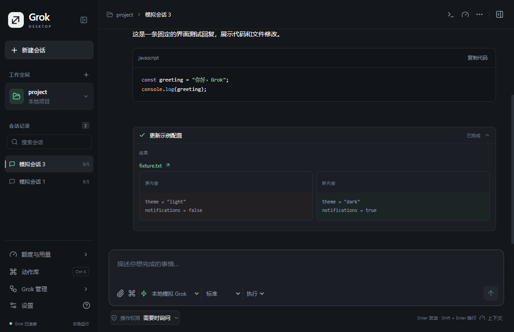

# Grok Desktop

[中文](README.md) · English

[Download for Windows](https://github.com/masonyang71324-oss/grok-desktop/releases) · [Report a bug](https://github.com/masonyang71324-oss/grok-desktop/issues)

An **unofficial**, Windows desktop interface for Grok Build. It is not an xAI product and is not affiliated with or endorsed by xAI. Grok Build handles authentication, model requests and conversation history.



## Getting started

1. Install and sign in to the official [Grok Build CLI](https://docs.x.ai/build/overview).
2. Download and run the installer (Setup.exe) or portable executable (Windows.exe) from [Releases](https://github.com/masonyang71324-oss/grok-desktop/releases).
3. Open a project and describe your task. Use the controls below the composer to choose the model, reasoning effort and approval mode.
4. Choose **English** or **简体中文** in **Settings → Language** (设置 → 界面语言). The change applies immediately and is remembered after restart.

The app searches GROK_HOME/bin, ~/.grok/bin, the local application directory and PATH for grok.exe. Official npm installations also initialize the native executable in the Grok home directory. If discovery fails, Settings provides a file picker and a link to the official installation instructions.

## Features

- Project conversations, local drafts and restart recovery.
- A task center for background conversations, pending approvals and queued messages. Different projects can run concurrently; tasks in the same folder run in sequence. Stopped or failed queues require manual continuation.
- Per-turn file checkpoints with review, selective restore, undo and record deletion. Later file changes prevent overwriting.
- Attach files, selected code or Git diffs. Pasted screenshots are saved automatically with clickable thumbnails; sending uses native image input or asks Grok to read the exact local image files.
- Native PDF/PPTX reading plus local Word, spreadsheet, compatible WPS, legacy PPT, OFD, OpenDocument, RTF, email and EPUB extraction. Preview attachments or open originals; failures keep the draft. See [formats and limits](docs/attachment-formats.md).
- Discover npm scripts and run, stop or restart them with buttons, live logs and local preview links.
- English / Simplified Chinese UI, including approval choices, management forms, usage panels, native menus and notifications.
- Switching languages preserves conversation text, code, file contents and command arguments. Per-conversation permissions remain available; pending approvals always keep their explicit decision.
- Notifications and taskbar attention for approvals, completion and failures while the app is in the background.
- Syntax highlighting, code copying and file links in tool changes.
- File previews and editing that preserve CRLF/LF, detect external changes and replace files through a temporary file.
- Git changes, diff line numbers, live project refresh and opening files in external editors.
- Drag-and-drop text/code attachments, restored window geometry and panel preferences.
- Account allowance and conversation context, plus structured Grok management actions.

## Development

Windows and Node.js 22.22 or newer are required. Run commands from this directory:

```powershell
npm ci
npx playwright install chromium
npm test
npm run build
npm run test:e2e
npm start
```

The E2E suite uses a local mock ACP process and does not need a Grok account. See [E2E instructions](tests/E2E.md). Tests use Playwright Chromium by default; PLAYWRIGHT_CHANNEL can explicitly select an installed browser.

Use npm run format / npm run format:check for formatting, npm run bench:markdown for a reproducible renderer benchmark, and npm run dist for Windows installer and portable builds. For frontend development, start npm run dev, then launch Electron with GROK_DESKTOP_DEV_URL=http://127.0.0.1:5197.

## Data and current limits

Documents are limited to 10 MB each. Extracted content: 1 MB each / 4 MB combined; native documents: 20 MB combined. Background extraction times out after 30 seconds and preserves drafts on failure without silent truncation. Local extraction omits images, seals and layout, does not execute macros or recalculate formulas. Recognized WPS-compatible structures are supported; CAJ requires CAJViewer → Print to PDF. See [formats and limitations](docs/attachment-formats.md).

Desktop settings, drafts, queued messages, pasted images, file checkpoints and rotating operational logs are local to the application data directory. Checkpoints contain recorded project file contents and can be removed in Project tools. They are bounded recovery records, not full project backups; omitted files are listed explicitly. Logs exclude prompt text, tool arguments, attachment contents and upstream error bodies. Online tasks still send the requested context to the selected Grok service.

Each opened conversation has its own Grok connection. Different folders can run concurrently; turns and file restoration in the same folder are serialized. Reloading the interface reconnects to live tasks. Work interrupted by an application exit is never resent automatically; review and resume it in the task center. Account limits still apply to concurrent requests.

Text attachments are limited to 1 MB each / 4 MB total, and images to 10 MB each / 20 MB total. Images use native ACP input when supported; otherwise each absolute file path is sent with a request to view it using read_file. On 2026-09-08, a real ACP session with Grok Build 1.0.13 correctly identified shapes, colors and text in a local test image. This route requires Grok's image-reading tool and file access permission. Pasted screenshots are stored under attachments in the application data directory; unrelated screenshots are never automatically scanned or sent. Audio input is not implemented. Running npm scripts requires Node.js. macOS/Linux packaging and terminal integration are not implemented. The “Grok Build update” action updates the CLI only.

Builds are unsigned; desktop auto-update hosting and a source license remain unconfigured. The source remains UNLICENSED. The package's private field prevents accidental npm publication; this GitHub repository is public. See [architecture](docs/architecture.md), [changes](CHANGELOG.md), the [1.1.0 historical review](docs/review-response-1.1.0.md) and the [GitHub publishing guide](docs/github-publishing.md).
