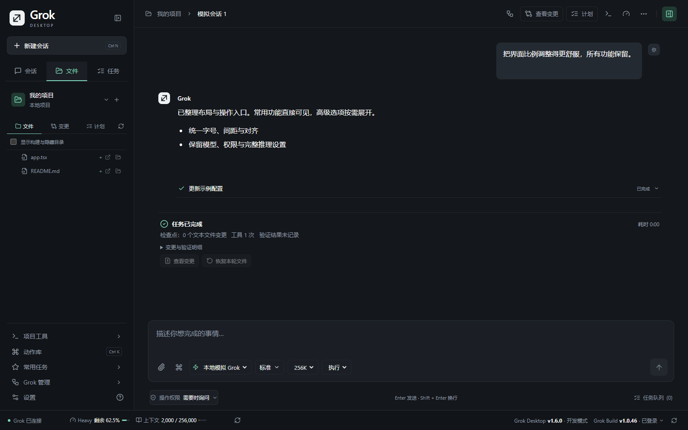

# Grok Desktop

中文 · [English](README.en.md)

[下载 Windows 版本](https://github.com/masonyang71324-oss/grok-desktop/releases) · [反馈问题](https://github.com/masonyang71324-oss/grok-desktop/issues)

面向 Windows 的 **非官方** Grok Build 桌面工作台。此项目不属于 xAI，也不代表 xAI；账号认证、模型请求和历史会话由官方 Grok Build 处理。



## 开始使用

1. 从 [Releases](https://github.com/masonyang71324-oss/grok-desktop/releases) 下载并运行安装版（Setup.exe）或免安装版（Windows.exe）。
2. 首次引导可安装官方稳定版 CLI，也可选择已有的 grok.exe；在官方登录窗口完成登录后返回检查。也可按照 [Grok Build 官方说明](https://docs.x.ai/build/overview) 手动安装。
3. 选择项目文件夹，在输入区描述任务。模型、推理深度与操作权限均可通过按钮选择。
4. 在“设置 → 界面语言”选择“简体中文”或“English”。立即生效，重启后保留。

程序会探测 GROK_HOME/bin、用户目录下的 .grok/bin、本地应用目录以及 PATH。找不到 CLI 时打开首次使用引导。底栏的“Grok Build”菜单还可打开引导和模型来源配置；自定义模型引用环境变量中的密钥，不显示已有密钥内容。

## 主要功能

最新升级：[1.10.0 架构与可靠性改进](docs/release-1.10.0.md)，包括检查点去重、内部进程回收、诊断预览导出、只读批准、单次自动重连和更新通道。此前升级：[1.9.0 五组使用体验改进](docs/release-1.9.0.md)。[文档入口](docs/README.md)保留历史证据。

- 当前会话全文搜索、提问目录、格式化复制、数学公式和长对话渲染优化。
- 输入区可搜索引用项目文件、调用 Windows 语音输入；侧栏/文件栏/输入区可拖动调整并记住尺寸。
- DOCX、工作表、PPTX提供只读排版预览，差异支持左右对照、词级标记与上下文折叠；复杂内容会明确说明限制，保留文字及默认程序打开入口。
- 内置 PowerShell 交互终端；隔离网页预览窗口的截图可回到原会话草稿，均按需打开。
- 回收完全空闲的引擎连接并保留会话；官方 CLI/ACP 变动有独立维护检查。完整范围见 [1.7.1 更新说明](docs/archive/releases/release-1.7.1.md) 和 [验证记录](docs/upgrade-1.7.1-validation.md)。

- 左侧“会话 / 文件 / 任务”统一导航，底栏常驻连接、额度、上下文和两个软件的版本入口；面板切换保留草稿与文件编辑。
- 项目会话、草稿自动保存、重启恢复；尚未选择项目的输入也会保存。
- 任务中心集中查看后台会话和待批准操作；不同项目可同时执行，同一项目自动排队。可在任务运行时补充排队消息，停止或出错后由你手动继续。
- 项目工具记录每轮任务的文件变化，可查看、选择恢复、撤销恢复和删除旧记录；发现后续修改时会阻止覆盖。
- 一键将文件、选中的代码或 Git 差异加入上下文。粘贴截图会自动保存，显示缩略图并可点击预览；发送时直接传图或让 Grok 读取对应图片文件。
- PDF/PPTX 优先使用 Grok 原生读取；Word、Excel、兼容 WPS、旧版 PPT、OFD、开放文档、RTF、邮件和 EPUB 自动提取内容。点击附件可预览或打开原文件；失败保留草稿。详见 [附件格式与限制](docs/attachment-formats.md)。
- 自动列出项目的 npm 脚本，通过按钮运行、停止、重新运行和打开本地预览，并查看运行日志。
- 中文 / English 界面，包括批准按钮、管理表单、额度面板和系统通知；当前对话权限可直接设置。
- 语言切换不改写聊天正文、代码、文件内容或命令参数；运行中改变后续权限不会代替当前待批决定。
- 应用处于后台时，任务完成、失败或需要批准会通过任务栏和系统通知提醒，可在设置关闭。
- 代码块高亮与复制、工具修改前后内容对照、点击文件定位。
- UTF-8 文件编辑保留 CRLF/LF 和 BOM，保存前检查外部变化，通过同目录临时文件完成替换；其他编码会提示使用系统应用打开，避免乱码保存。
- Git 变更与差异行号、任务执行中的目录刷新、外部编辑器和资源管理器入口。
- 拖入文本/代码附件，记住窗口位置、尺寸、侧栏及 Inspector 页签。
- 套餐额度与会话上下文查询，MCP、插件、工作流、后台任务和工作树等管理入口。
- 安装版自动检查 GitHub 稳定版本，可在应用内下载并选择何时重启安装；便携版会打开官方下载页。

## 开发

需要 Windows 和 Node.js 22.22 或更新版本。在此目录执行：

```powershell
npm ci
npx playwright install chromium
npm test
npm run build
npm run test:e2e
npm start
```

E2E 使用本地假 Grok，不需要订阅或真实账号，运行实际 Electron 主进程、preload 和界面。详情见 [E2E 说明](tests/E2E.md)。组件测试默认使用 Playwright 自带 Chromium；仅在主动设置 PLAYWRIGHT_CHANNEL 时使用其他已安装浏览器。

- npm run format / npm run format:check：统一格式与检查。
- npm run bench:markdown：复现长回复渲染基准。
- npm run dist：生成 Windows 安装版和免安装版。
- npm run dev：前端开发服务；另开终端设置 GROK_DESKTOP_DEV_URL=http://127.0.0.1:5197 后执行 npm start。

## 数据与限制

文档单个限 10 MB，本地提取后的内容单个限 1 MB、文本合计限 4 MB，原生文档合计限 20 MB。后台提取最长 30 秒，失败或超过上限时保留草稿，不静默截断。本地提取不含图片、签章和排版，不运行宏或重算公式。WPS 支持可识别的兼容结构；CAJ 等文献需先用 CAJViewer 打印为 PDF。详细支持范围、中文编码和预览说明见 [附件格式](docs/attachment-formats.md)。

桌面设置、草稿、排队消息、粘贴的截图、文件检查点和运行日志位于应用数据目录，默认是 %APPDATA%/Grok Desktop。检查点包含被记录的项目文件内容，可在项目工具中删除；它不是完整项目备份，会明确列出未纳入的文件。日志按大小轮转，仅包含操作类别和状态，不保存对话正文、附件内容、工具参数或上游错误原文。在线模型任务仍会把所需上下文交给所选 Grok 服务。

每个已打开会话使用独立 Grok 连接，不同目录可并行；同一目录的任务和文件恢复串行执行。窗口重新载入会恢复后台任务；应用退出造成的中断不会自动重发，需在任务中心确认后继续。并发任务仍受账号额度限制。

文本附件单个限 1 MB、总计 4 MB；图片单个限 10 MB、总计 20 MB。支持 ACP 图片输入时直接发送图片；否则附上每张图片的完整路径，让 Grok 用 read_file 读取。2026-09-08 已通过实际 ACP 会话验证 Grok Build 1.0.13 能读出本地测试图的形状、颜色和文字。此方式需要 Grok 的本地图片读取工具及文件访问权限。粘贴截图保存在应用数据目录的 attachments 文件夹，不会自动扫描或发送其他截图。音频输入尚未实现。运行 npm 脚本需要安装 Node.js。当前提供 Windows 版本，macOS/Linux 的打包与终端集成尚未实现。“检查 Grok Build 更新”更新的是官方 CLI。Grok Desktop 当前版本和更新状态常驻在首页顶部，点击即可检查；详细下载与安装控制仍位于“设置 → 软件更新”。安装版支持应用内下载和重启安装；便携版发现新版后会打开官方下载页。首次使用自动更新仍需手动安装 1.4.1 或更新版本。

首页也显示 Grok Build 引擎版本与实际登录状态。点击引擎入口可启动官方登录、刷新模型目录、检查及安装引擎更新；目录刷新保留当前会话与后台任务，引擎更新需等待任务结束。会话输入栏按模型公布的选项提供上下文窗口选择，真实 Grok Build 1.0.46 已验证 Grok 4.7 的 256K/500K 选项。模型可用性以登录账号返回为准。

安装包尚未配置发布者签名，源码保持 UNLICENSED。package 的 private 字段用于防止意外发布到 npm，不影响本 GitHub 仓库公开访问。

参见 [架构说明](docs/architecture.md)、[版本记录](CHANGELOG.md) 和 [1.1.0 历史审阅处理结果](docs/archive/reviews/review-response-1.1.0.md)。

公开仓库与下载程序的准备方式见 [GitHub 发布说明](docs/github-publishing.md)。
